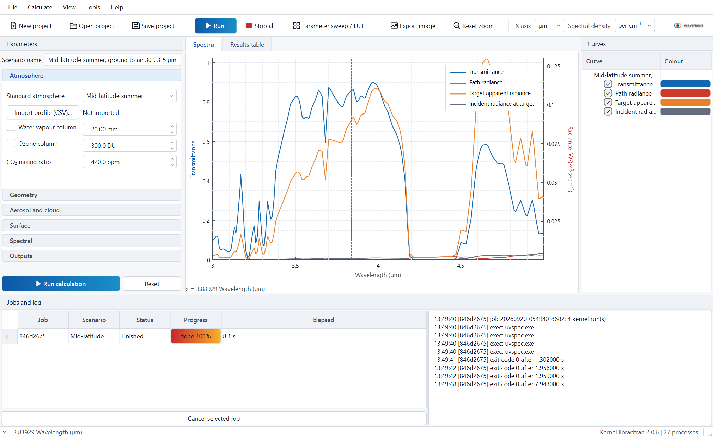
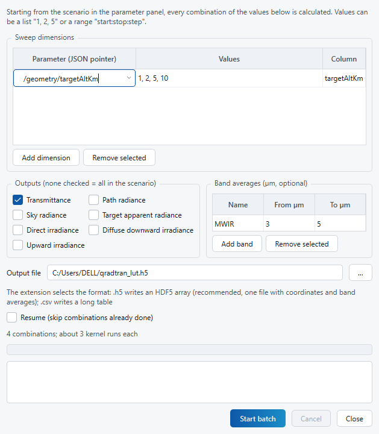
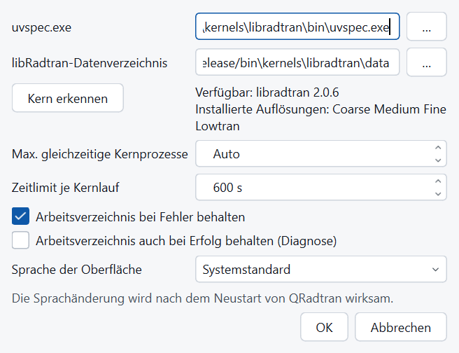
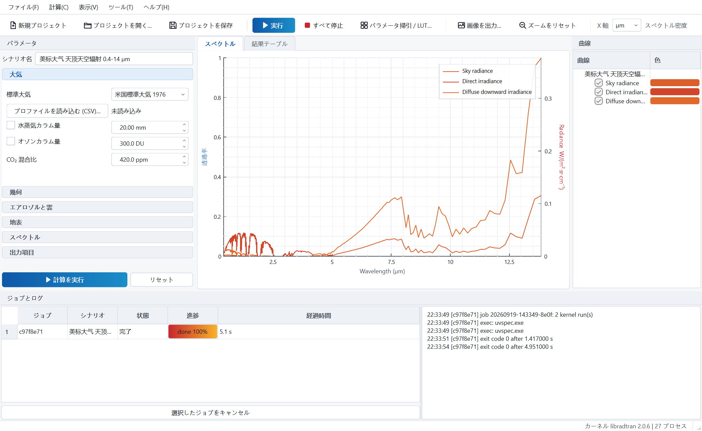
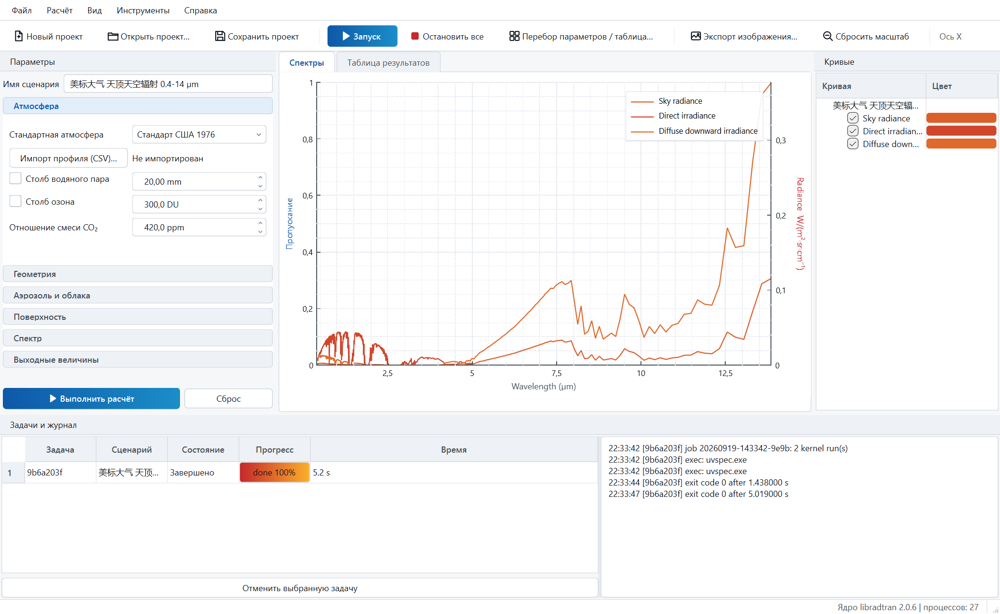
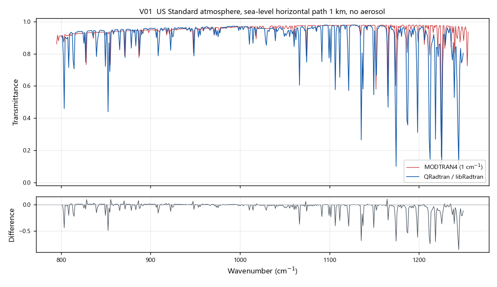
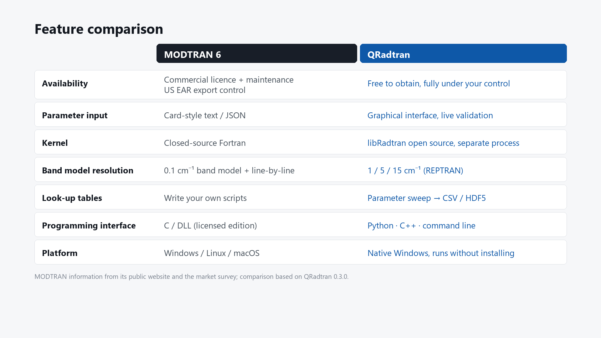

<div align="center">


# QRadtran

**Atmospheric transmittance and radiance software for Windows**

Built for infrared and electro-optical system engineers on the open-source radiative transfer kernel [libRadtran](https://www.libradtran.org/)

[](https://github.com/angaio/QRadtran/releases/latest)
[](#download-and-install)
[](#multilingual-interface)
[](https://www.libradtran.org/)

[简体中文](README.md) · [User manual](docs/manual_en.md) · [Download the installer](https://github.com/angaio/QRadtran/releases/latest)

</div>

---

QRadtran computes, through a graphical interface on Windows, the **spectral transmittance of slant and horizontal paths**, **path and sky radiance** and the **apparent radiance of a target**. It supports multi-curve comparison, parameter sweeps that produce look-up tables (CSV / HDF5), a command-line tool and a Python interface. The libRadtran kernel is installed together with the software — no separate Python, MSYS2 or WSL setup is required.



## Features

| Area | What it does |
|---|---|
| **Atmosphere** | The six AFGL standard atmospheres (tropical, mid-latitude summer/winter, sub-arctic summer/winter, US Standard 1976); import your own pressure/temperature/humidity sounding from CSV; adjustable water vapour column, ozone column and CO₂ mixing ratio |
| **Geometry** | Slant path (observer → target), horizontal path, whole vertical column, sky radiance only; between 85° and 95° zenith the near-horizontal path switches to a layered extinction integration |
| **Aerosol and cloud** | Shettle rural / urban / maritime / tropospheric models and OPAC mixtures; visibility, season and stratospheric volcanic loading; a single water or ice cloud layer |
| **Spectral** | REPTRAN band model at 1 / 5 / 15 cm⁻¹ plus LOWTRAN 20 cm⁻¹; switch freely between µm, nm and cm⁻¹; the solar and thermal bands are computed separately and joined automatically |
| **Solver** | DISORT (multiple scattering, configurable streams) and a two-stream approximation; DISORT is selected automatically whenever a radiance is requested |
| **Outputs** | Path transmittance, path radiance, sky radiance, direct / diffuse downward / upward irradiance, target apparent radiance and the incident radiance at the target |
| **Batch** | Parameter sweeps over the Cartesian product of the chosen values, written as an HDF5 array (with coordinates, band averages and resume flags) or a long CSV table; interrupted runs can be resumed |
| **Interfaces** | Graphical interface, `qradtran-cli` command line and the `pyqradtran` Python package — all sharing the same core library and kernel, so results are identical |

<table>
<tr>
<td width="50%"><br><sub>Parameter sweep and HDF5 look-up table export</sub></td>
<td width="50%"><br><sub>Kernel, concurrency and interface language settings</sub></td>
</tr>
</table>

## Download and install

Download `QRadtran-0.3.0-Setup-x64.exe` (about 826 MB) from [Releases](https://github.com/angaio/QRadtran/releases/latest) and run it.

| Item | Requirement |
|---|---|
| Operating system | Windows 10 / 11, 64-bit |
| Processor | 4 cores or more recommended; the kernel runs in parallel processes, so more cores make batch runs faster |
| Memory | 8 GB or more |
| Disk | About 1.2 GB after installation, of which 736 MB are the REPTRAN spectral tables for all three resolutions |
| Other | No Python, MSYS2 or WSL needed; the VC++ runtime is included |

The installer is large because it **bundles the spectral tables for all three resolutions**, so fine-resolution (1 cm⁻¹) runs work out of the box without a separate ~700 MB download. "Install for me only" avoids the need for administrator rights, and the release folder can also simply be copied and run without installing at all.

The Python interface is optional and needs a system Python 3.10 (64-bit) with numpy.

## Multilingual interface

The interface, the installer and the user manual are available in **简体中文 · English · Русский · 日本語 · 한국어 · Français · Deutsch · Español**.

By default the software follows the Windows display language. It can be changed under Tools → Settings → Interface language (effective after a restart), or forced on the command line:

```bat
QRadtran.exe --lang ja
```

<table>
<tr>
<td width="50%"></td>
<td width="50%"></td>
</tr>
</table>

> The Chinese and English texts are written by hand; the other six languages are machine-assisted first drafts. Corrections through issues are very welcome.

## Documentation

| Language | Markdown | HTML |
|---|---|---|
| English | [manual_en.md](docs/manual_en.md) | [manual_en.html](docs/manual_en.html) |
| 简体中文 | [manual_zh_CN.md](docs/manual_zh_CN.md) | [manual_zh_CN.html](docs/manual_zh_CN.html) |
| Русский | [manual_ru.md](docs/manual_ru.md) | [manual_ru.html](docs/manual_ru.html) |
| 日本語 | [manual_ja.md](docs/manual_ja.md) | [manual_ja.html](docs/manual_ja.html) |
| 한국어 | [manual_ko.md](docs/manual_ko.md) | [manual_ko.html](docs/manual_ko.html) |
| Français | [manual_fr.md](docs/manual_fr.md) | [manual_fr.html](docs/manual_fr.html) |
| Deutsch | [manual_de.md](docs/manual_de.md) | [manual_de.html](docs/manual_de.html) |
| Español | [manual_es.md](docs/manual_es.md) | [manual_es.html](docs/manual_es.html) |

The manual has 14 sections covering installation, the interface, the physical meaning and range of every parameter, typical workflows, parameter sweeps and the HDF5 layout, the command line, the Python interface, accuracy notes and frequently asked questions. The same files are installed under `doc\` in the installation folder.

## Accuracy

QRadtran was benchmarked case by case against MODTRAN4 in the long-wave and mid-wave atmospheric windows: **in 6 of 8 judged cases the band-averaged window transmittance agrees to better than 0.04, and to 0.003 in the best case**.



Band-averaged transmittance for case V01 (US Standard atmosphere, sea-level horizontal path of 1 km, no aerosol, 8–12.5 µm):

| Band | QRadtran | MODTRAN4 | Difference |
|---|---|---|---|
| 10–11 µm window | 0.9508 | 0.9533 | −0.003 |
| 8–12 µm | 0.9036 | 0.9502 | −0.047 |
| 8.5–9.5 µm | 0.9070 | 0.9608 | −0.054 |

Judgement is made in clean windows only, supported by an internal consistency check between two independent band models (REPTRAN and LOWTRAN) and by the geometric self-consistency of 60° slant and vertical paths. **Differences inside strong absorption bands are diagnostic only**: the MODTRAN4 build used as the reference applies no CO₂ absorption in the 15 µm band (verified: `CO2+ TRANS` is exactly 1.0 and a fourfold change of CO₂ alters nothing, while the 4.3 µm band behaves normally), so comparisons there carry no weight. Outside the windows, the direction of the systematic differences is consistent with the generation change in the HITRAN spectroscopic data.

## How it differs from MODTRAN



MODTRAN information is taken from its public website and public market material and is offered only as a selection aid; the QRadtran column reflects version 0.3.0. The two tools aim at different things: MODTRAN is the long-established commercial standard with more complete spectroscopy and broader band coverage, while QRadtran aims at an **open kernel, a graphical workflow, full local control and free availability** — suited to engineering-grade transmittance and radiance estimates on Windows and to generating look-up tables for your own simulation chain.

## Command line and Python

```bat
qradtran-cli example --out case.json          :: write a template scenario
qradtran-cli run case.json --out out.csv      :: compute and export CSV
qradtran-cli batch plan.json --out lut.h5     :: parameter sweep to an HDF5 look-up table (--resume to continue)
qradtran-cli kernel-info                      :: kernel status and available resolutions
```

```python
import pyqradtran as qr

s = qr.Scenario.standard("MidlatitudeSummer")
s.geometry.mode = "SlantPath"
s.geometry.target_alt_km = 10.0
s.geometry.view_zenith_deg = 30.0
s.spectral.set_range(3, 5, unit="Micrometer", step=0.01, resolution="Coarse")
s.outputs.transmittance = True

r = qr.run(s)
nu, T = r.wavenumber, r["Transmittance"]          # numpy arrays
print(r.band_average("Transmittance", 3.0, 5.0))  # {'average': …, 'integral': …}
```

The HDF5 layout (`/<Quantity>[dim1…dimN, spectral]`, `/coords/*`, `/bands/*`, `/filled`) is described in [section 7 of the manual](docs/manual_en.md) and can be read directly with h5py, MATLAB or IDL.

## Kernel and licensing

QRadtran is built as a **graphical interface plus an external compute process**: the libRadtran kernel `uvspec.exe` is never linked into the application. The interface writes an input file, launches the kernel as a separate process and parses its output. This avoids the multi-instance hazards of Fortran global state and keeps the kernel independently replaceable and upgradable.

This project is released under the **GPL v3**; the full text is in [LICENSE](LICENSE). This repository distributes the **installer and the user documentation**. Third-party components and their licences:

| Component | Licence | Notes |
|---|---|---|
| libRadtran 2.0.6 | GPL v2 | Run as a separate process; **the complete source archive, patches and build script ship with the installer** under `kernels\libradtran\source\` |
| QCustomPlot 2.1.1 | GPL v3 / commercial | Plotting widget of the graphical interface |
| Qt 6 | LGPL v3 | Dynamically linked |
| HDF5 | BSD | Look-up table output |
| nlohmann/json | MIT | Scenario and project files |
| pybind11 | BSD | Python bindings |
| MinGW-w64 runtime | GPL with runtime exception | Required by the compiled kernel |

The full licence texts are in `licenses\` in the installation folder. If you need the libRadtran sources without installing the software, please ask through the contact below.

## Releases

**0.3.0** (2026-09) — full multilingual support across the interface, installer, manuals and marketing material (eight languages); localized preset scenario names; various layout fixes.

**0.2.0** — HDF5 look-up table output; all three REPTRAN resolutions bundled in the installer; Python bindings; validation report against MODTRAN4.

## Contact

**Wuhan WaveFront Co., Ltd.** · WeChat: **angaio**

Questions and suggestions are welcome through [issues](https://github.com/angaio/QRadtran/issues). When reporting an unexpected result, please attach the project file (`.json`) and the contents of the log panel.
