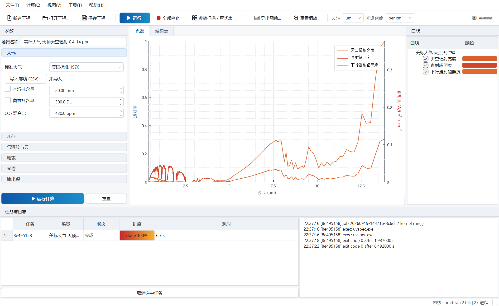

<div align="center">


# QRadtran

**大气透过率与辐射计算软件 · Windows 桌面版**

面向红外与光电系统工程师，基于开源辐射传输内核 [libRadtran](https://www.libradtran.org/) 构建

[](https://github.com/angaio/QRadtran/releases/latest)
[](#下载与安装)
[](#多语言界面)
[](https://www.libradtran.org/)

[English](README.en.md) · [用户手册](docs/manual_zh_CN.md) · [下载安装包](https://github.com/angaio/QRadtran/releases/latest)

</div>

---

QRadtran 在 Windows 上以图形界面完成**斜程与水平路径透过率**、**路径与天空辐射亮度**、**目标表观辐射亮度**的光谱计算，支持多曲线对比、参数扫描生成查找表（CSV / HDF5）、命令行与 Python 调用。计算内核 libRadtran 随软件一起安装，无需另行配置 Python、MSYS2 或 WSL。



## 主要功能

| 模块 | 能力 |
|---|---|
| **大气** | AFGL 六种标准大气（热带、中纬度冬夏、亚北极冬夏、美国标准 1976）；导入自定义温压湿廓线（CSV）；水汽柱、臭氧柱、CO₂ 混合比可调 |
| **几何** | 斜程（观测者→目标）、水平路径、整层垂直、仅天空辐射；天顶角 85°–95° 自动改用分层消光积分处理近水平路径 |
| **气溶胶与云** | Shettle 乡村 / 城市 / 海洋 / 对流层模型与 OPAC 组分；能见度、季节、平流层火山档位；单层水云或冰云 |
| **光谱** | REPTRAN 带模式 1 / 5 / 15 cm⁻¹ 与 LOWTRAN 20 cm⁻¹；µm / nm / cm⁻¹ 任意切换；太阳段与热红外段自动拆分计算再拼接 |
| **求解器** | DISORT（多次散射，流数可调）与两流近似；需要辐射亮度时自动改用 DISORT |
| **输出** | 路径透过率、路径辐射亮度、天空辐射亮度、直射 / 下行漫射 / 上行辐照度、目标表观辐射亮度与目标处入射辐射亮度 |
| **批量** | 参数扫描取笛卡尔积，输出 HDF5 多维数组（含坐标、带平均、断点标记）或 CSV 长表，支持断点续跑 |
| **接口** | 图形界面、命令行 `qradtran-cli`、Python 包 `pyqradtran`（共用同一核心库与内核，结果一致） |

<table>
<tr>
<td width="50%"><br><sub>参数扫描与 HDF5 查找表导出</sub></td>
<td width="50%"><br><sub>内核、并发与界面语言设置</sub></td>
</tr>
</table>

## 下载与安装

从 [Releases](https://github.com/angaio/QRadtran/releases/latest) 下载 `QRadtran-0.3.0-Setup-x64.exe`（约 826 MB），双击安装即可。

| 项目 | 要求 |
|---|---|
| 操作系统 | Windows 10 / 11，64 位 |
| 处理器 | 建议 4 核以上（内核多进程并行，核数越多批量计算越快） |
| 内存 | 8 GB 以上 |
| 磁盘 | 安装后约 1.2 GB，其中 736 MB 为三档分辨率的 REPTRAN 谱参数表 |
| 其他 | 无需安装 Python、MSYS2 或 WSL；VC++ 运行库已内置 |

安装包体积较大是因为**内置了全部三档分辨率的光谱参数表**，装完即可用细分辨率（1 cm⁻¹）计算，不必再单独下载约 700 MB 的数据。可选择「仅为我安装」免管理员权限；也可以不用安装程序，把发布目录整个复制走直接运行。

Python 接口为可选功能，需要本机自带 Python 3.10 64 位与 numpy。

## 多语言界面

界面、安装程序与用户手册均提供 **简体中文 · English · Русский · 日本語 · 한국어 · Français · Deutsch · Español** 八种语言。

默认跟随 Windows 显示语言，可在「工具 → 设置 → 界面语言」中更改（重启生效），也可用命令行参数临时指定：

```bat
QRadtran.exe --lang ja
```

<table>
<tr>
<td width="50%"></td>
<td width="50%"></td>
</tr>
</table>

> 中文与英文文案为人工撰写，其余六种语言为机器辅助翻译的初稿，欢迎通过 Issue 指出用词问题。

## 文档

| 语言 | Markdown | HTML |
|---|---|---|
| 简体中文 | [manual_zh_CN.md](docs/manual_zh_CN.md) | [manual_zh_CN.html](docs/manual_zh_CN.html) |
| English | [manual_en.md](docs/manual_en.md) | [manual_en.html](docs/manual_en.html) |
| Русский | [manual_ru.md](docs/manual_ru.md) | [manual_ru.html](docs/manual_ru.html) |
| 日本語 | [manual_ja.md](docs/manual_ja.md) | [manual_ja.html](docs/manual_ja.html) |
| 한국어 | [manual_ko.md](docs/manual_ko.md) | [manual_ko.html](docs/manual_ko.html) |
| Français | [manual_fr.md](docs/manual_fr.md) | [manual_fr.html](docs/manual_fr.html) |
| Deutsch | [manual_de.md](docs/manual_de.md) | [manual_de.html](docs/manual_de.html) |
| Español | [manual_es.md](docs/manual_es.md) | [manual_es.html](docs/manual_es.html) |

手册共 14 节，涵盖安装、界面、各参数面板的物理含义与取值范围、典型操作流程、参数扫描与 HDF5 布局、命令行、Python 接口、精度说明与常见问题。安装后同样位于安装目录的 `doc\` 下。

## 精度验证

以 MODTRAN4 为参照，在长波与中波大气窗区逐算例对标：**8 个判定算例中 6 个的窗区带平均透过率偏差在 0.04 以内，最好者 0.003**。


算例 V01（美标大气，海平面水平 1 km，无气溶胶，8–12.5 µm）的带平均透过率：

| 波段 | QRadtran | MODTRAN4 | 偏差 |
|---|---|---|---|
| 10–11 µm 窗区 | 0.9508 | 0.9533 | −0.003 |
| 8–12 µm | 0.9036 | 0.9502 | −0.047 |
| 8.5–9.5 µm | 0.9070 | 0.9608 | −0.054 |

判定只在洁净窗区进行，并辅以 REPTRAN 与 LOWTRAN 两套独立带模式的内部一致性检查、以及 60° 斜程与垂直路径的几何自洽性检查。**强吸收带内的差异仅作诊断**：用作参照的那份 MODTRAN4 构建在 15 µm 带不施加 CO₂ 吸收（已证实：`CO2+ TRANS` 恒为 1.0，CO₂ 浓度改变 4 倍结果不变，而 4.3 µm 带正常），因此这些波段的对比不具判定意义。窗区之外的系统性差异方向与 HITRAN 谱学数据的换代一致。

## 与 MODTRAN 的差异


MODTRAN 相关信息取自其官网公开资料与公开市场资料，仅供选型参考；QRadtran 一侧基于 0.3.0 版本。二者定位不同：MODTRAN 是工业界长期使用的商业标准，谱学模型与波段覆盖更完整；QRadtran 的取向是**开放内核、图形化、自主可控、免费获取**，适合在 Windows 上快速完成工程量级的透过率与辐射估算，并批量生成查找表接入自己的仿真链路。

## 命令行与 Python

```bat
qradtran-cli example --out case.json          :: 生成模板场景
qradtran-cli run case.json --out out.csv      :: 计算并导出 CSV
qradtran-cli batch plan.json --out lut.h5     :: 参数扫描，输出 HDF5 查找表（--resume 断点续跑）
qradtran-cli kernel-info                      :: 查看内核状态与可用分辨率
```

```python
import pyqradtran as qr

s = qr.Scenario.standard("MidlatitudeSummer")
s.geometry.mode = "SlantPath"
s.geometry.target_alt_km = 10.0
s.geometry.view_zenith_deg = 30.0
s.spectral.set_range(3, 5, unit="Micrometer", step=0.01, resolution="Coarse")
s.outputs.transmittance = True

r = qr.run(s)
nu, T = r.wavenumber, r["Transmittance"]          # numpy 数组
print(r.band_average("Transmittance", 3.0, 5.0))  # {'average': …, 'integral': …}
```

HDF5 查找表的布局（`/<量名>[维度1…维度N, 光谱]`、`/coords/*`、`/bands/*`、`/filled`）见[用户手册第 7 节](docs/manual_zh_CN.md)，可用 h5py、MATLAB、IDL 直接读取。

## 计算内核与许可

QRadtran 采用**图形界面 + 独立计算进程**的结构：内核 libRadtran `uvspec.exe` 不被链接进应用，而是由界面写入输入文件、以独立进程调用、再解析其输出。这样既避免了 Fortran 全局变量带来的多实例风险，也使内核可以单独替换或升级。

本项目以 **GPL v3** 发布，许可证全文见 [LICENSE](LICENSE)。本仓库分发 QRadtran 的**安装程序与用户文档**。第三方组件及其许可：

| 组件 | 许可 | 说明 |
|---|---|---|
| libRadtran 2.0.6 | GPL v2 | 作为独立进程调用；**完整源码包、补丁与构建脚本随安装包提供**，位于安装目录 `kernels\libradtran\source\` |
| QCustomPlot 2.1.1 | GPL v3 / 商业 | 图形界面的绘图控件 |
| Qt 6 | LGPL v3 | 动态链接 |
| HDF5 | BSD | 查找表输出 |
| nlohmann/json | MIT | 场景与工程文件 |
| pybind11 | BSD | Python 绑定 |
| MinGW-w64 运行库 | GPL + 运行库例外 | 内核编译产物的依赖 |

各组件许可证全文位于安装目录的 `licenses\`。如需 libRadtran 的源码而不便安装本软件，可通过下方联系方式索取。

## 版本

**0.3.0**（2026-09） — 界面、安装程序、用户手册与宣传材料全面多语言化（八种语言）；预设场景名按语言显示；修正若干界面排版问题。

**0.2.0** — HDF5 查找表输出；安装程序内置全部三档 REPTRAN 谱数据；Python 绑定；与 MODTRAN4 的验证报告。

## 联系

**Wuhan WaveFront Co., Ltd.**（武汉波前科技） · 微信：**angaio**

问题与建议欢迎提交 [Issue](https://github.com/angaio/QRadtran/issues)；反馈计算结果异常时，请附上工程文件（`.json`）与日志面板的内容。
